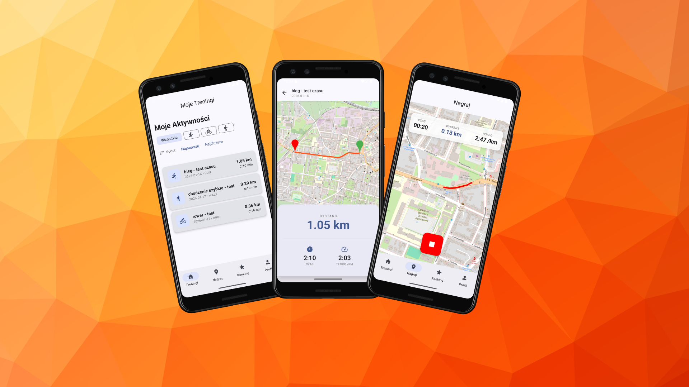

# Aktywni - Mobilny asystent treningowy

## O Projekcie
Aktywni to nowoczesna, natywna aplikacja mobilna na system Android, stworzona w języku Kotlin, inspirowana rozwiązaniami takimi jak Strava. Projekt łączy funkcje trackera GPS z elementami serwisu społecznościowego, umożliwiając użytkownikom nie tylko rejestrowanie tras, ale także dzielenie się osiągnięciami.

Projekt został zrealizowany w architekturze Klient-Serwer. Aplikacja mobilna pełni rolę klienta, który w czasie rzeczywistym komunikuje się z zewnętrznym backendem, zapewniając synchronizację danych między urządzeniami.

## Architektura i Komunikacja
Aplikacja kładzie duży nacisk na nowoczesne standardy wytwarzania oprogramowania:

* REST API: Cała komunikacja z serwerem odbywa się poprzez protokół HTTP/REST. Aplikacja wysyła zapytania (GET, POST) w celu pobrania listy treningów, aktualizacji profilu czy wysłania nowej trasy.
* Asynchroniczność: Dzięki wykorzystaniu Kotlin Coroutines, operacje sieciowe wykonywane są w tle, nie blokując interfejsu użytkownika (UI).
* Warstwa sieciowa: Do obsługi zapytań API wykorzystano bibliotekę Retrofit, co zapewnia typowane i bezpieczne przetwarzanie danych JSON.
* OpenStreetMap: Integracja z otwartym standardem map (OSM) pozwala na renderowanie podkładów mapowych oraz rysowanie przebytej ścieżki na podstawie koordynatów GPS, bez uzależnienia od usług Google.

## Stack Technologiczny
* Mobile: Android (Kotlin), Jetpack Compose, OpenStreetMap (OSM)
* Backend: Node.js (Express), MariaDB
* Web:
* Komunikacja: Retrofit 2 + OkHttp

## ️ Ficzerki

1. [✅]Użytkownik może pobrać aplikację na systemy Android lub iOS.
2. [✅]Użytkownik może zarejestrować konto i zalogować się w aplikacji.
3. []Użytkownik może zresetować swoje hasło (np. gdy zapomni hasła).
4. [✅]Użytkownik po zalogowaniu może ustawić swoje dane profilowe takie jak: imię, nazwisko,
   data urodzenia, płeć, wzrost, waga i avatar. (imię, nazwisko).
5. [✅]Po zalogowaniu użytkownik może rozpocząć nową aktywność, pauzować i zakończyć ją
   oraz zapisać dane.
6. [✅]W trakcie aktywności aplikacja rejestruje czas, dystans, tempo, prędkość i ślad GPS.
7. [✅]Po zakończeniu aktywności użytkownik może nadać nazwę, dodać notatkę, zdjęcie i
   oznaczyć typ aktywności (rower, bieg, spacer).
8. [✅]Historia aktywności wyświetlana jest w formie listy.
9. [✅]Kliknięcie na aktywność otwiera szczegóły (trasa, czas, tempo, notatki, zdjęcie).
10. [✅]Użytkownik może filtrować i sortować swoje aktywności (np. po dacie, dystansie, typie).
11. [✅]Użytkownik może przeglądać zbiorczą listę treningów znajomych na stronie głównej -
    feed.
12. [✅]Aplikacja wyświetla podstawowe statystyki użytkownika (liczba treningów, łączny
    dystans, średnia prędkość).
13. [✅]Aplikacja obsługuje ranking użytkowników (np. sumaryczny dystans tygodniowy).
14. [✅]Aplikacja umożliwia synchronizację danych z serwerem (po zalogowaniu).
15. [✅]Aplikacja mobilna korzysta z REST API opisanym w punkcie 4.
16. [☑️]Interfejs aplikacji dostępny jest w języku polskim i angielskim.
17. [☑️]Wysyłanie i akceptowanie zaproszeń do znajomych,
18. [☑️]Możliwość zablokowania użytkownika i/lub zgłoszenia nadużycia.
19. [☑️]„Polubienia”(kudos) i proste komentarze pod zakończonym treningiem.
20. []Powiadomienia typu PUSH dla nowych zaproszeń, komentarzy/polubień pod
    zakończonym treningiem. 

## ️ Uruchamianie

## Uruchomienie Aplikacji

Aplikacja mobilna jest skonfigurowana do łączenia się z działającym, zdalnym serwerem backendowym. Aby ją uruchomić, można skorzystać z gotowego pliku instalacyjnego lub zbudować projekt samodzielnie.

### Opcja 1: Instalacja pliku APK (Zalecane)
Najszybszy sposób na przetestowanie aplikacji bez konieczności konfiguracji środowiska programistycznego.

1. Przejdź do sekcji Releases w tym repozytorium.
2. Pobierz najnowszy plik instalacyjny (np. aktywni_1.0.apk) na urządzenie z systemem Android.
3. Uruchom plik i postępuj zgodnie z instrukcjami instalatora (może być wymagane zezwolenie na instalację aplikacji z nieznanych źródeł).
4. Po zainstalowaniu aplikacja jest gotowa do działania i automatycznie połączy się z serwerem.

### Opcja 2: Uruchomienie z kodu źródłowego
Wymagane środowisko: Android Studio oraz JDK 17+.

1. Sklonuj repozytorium:
   git clone https://github.com/aktywni-pl/mobile.git
2. Otwórz projekt w Android Studio.
3. Poczekaj na zakończenie synchronizacji projektu z systemem Gradle (Gradle Sync).
4. Wybierz urządzenie docelowe (emulator lub podłączony smartfon).
5. Uruchom aplikację (Run 'app').